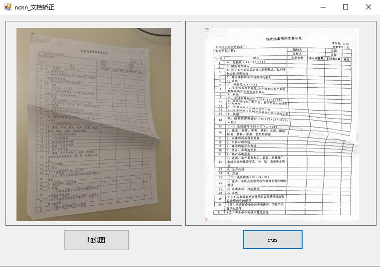
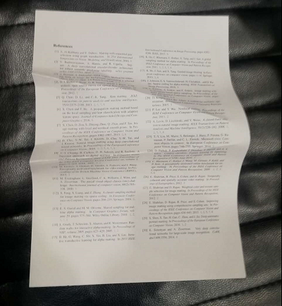
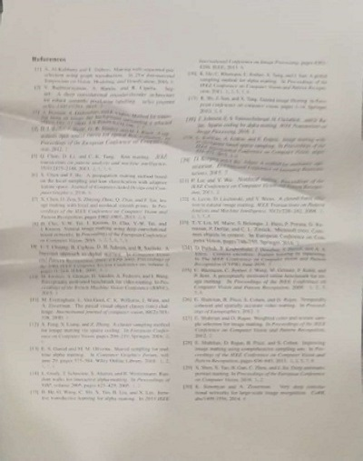
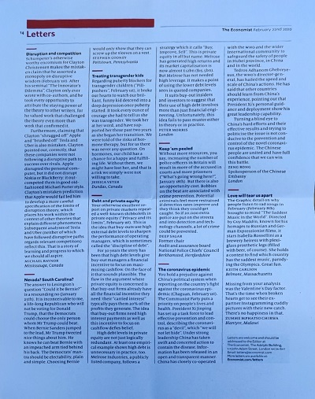

# DocTr-ncnn
ncnn demo of **DocTr: Document Image Transformer for Geometric Unwarping and Illumination Correction**

## model support:  
### 1.Document Segmentation  
### 2.Geometric Unwarping  
All models are available in [Baidu Pan](https://pan.baidu.com/s/1lny5IuL9TMUlfAUCg_6iuw) (69c4) 
### PS: the newest ncnn is needed, you should replace the binaryop.cpp and gemm.cpp file to you ncnn.    

### TODO:  
1.Illumination Correction model  
2.~~windows gui demo~~  
3.support ncnn-vulkan  
## Result 
  
  
  

## Reference  
1.https://github.com/fh2019ustc/DocTr  
2.https://github.com/Tencent/ncnn  
