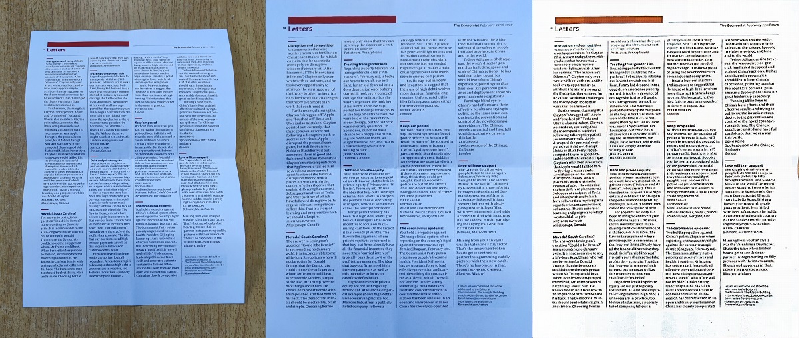

# DocTr-ncnn
ncnn demo of **DocTr: Document Image Transformer for Geometric Unwarping and Illumination Correction**

## model support:  
**1.Document Segmentation**  
**2.Geometric Unwarping**  
**3.Illumination Correction model**  
All models are available in [Baidu Pan](https://pan.baidu.com/s/1lny5IuL9TMUlfAUCg_6iuw) (69c4) 
### PS: 
**1.The newest ncnn is needed(which support 4d mat), you can replace the cpp files in replace dir to you ncnn,or use ncnn in this repo.**  
**2.This model use transformer,which is very unfriendly to deploy. So it may take 20~30 seconds to get the final result.**

### TODO:  
1.~~Illumination Correction model~~  
2.~~windows gui demo~~  
3.support ncnn-vulkan  
## Result 
  
  
  
  

## Reference  
1.https://github.com/fh2019ustc/DocTr  
2.https://github.com/Tencent/ncnn  
